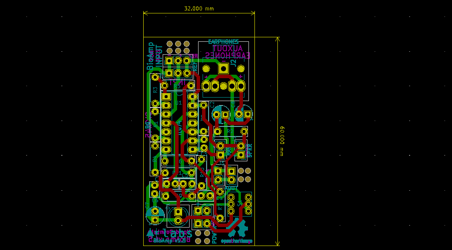
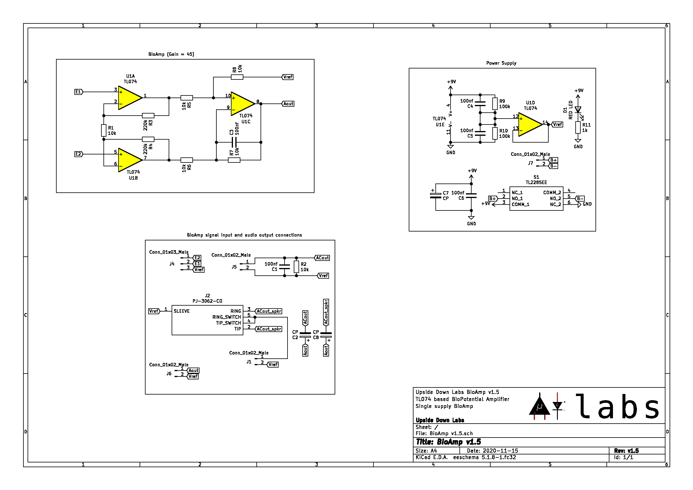

# Upside Down Labs BioAmp v1.5

  

BioAmp v1.5 is a single chip Bio-potential amplifier for recording any Bio-potential signal non-invasively. It's compatible with [Backyard Brains Spike Recorder](https://backyardbrains.com/products/spikerecorder), which you can use to record and visualize all the Bio-potential signals.

## v1.5.4 Board

Licenses Fact             |  OSHWA Certification
:-------------------------:|:-------------------------:
  | 

## License
#### Hardware
CERN Open Hardware License Version 2 - Strongly Reciprocal ([CERN-OHL-S-2.0](https://spdx.org/licenses/CERN-OHL-S-2.0.html)).

#### Software
MIT open source [license](http://opensource.org/licenses/MIT).

#### Documentation:
 This work is licensed under a <a rel="license" href="http://creativecommons.org/licenses/by/4.0/">Creative Commons Attribution 4.0 International License</a>.