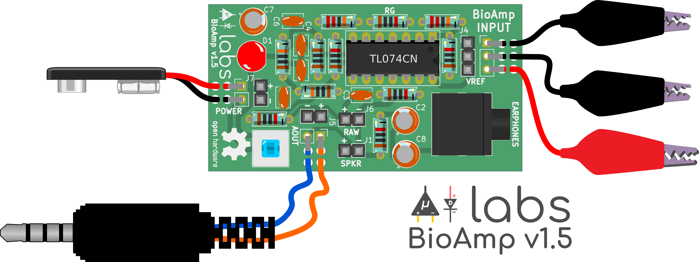
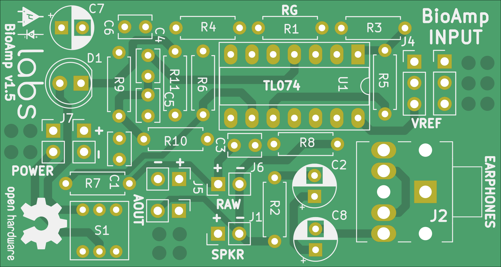
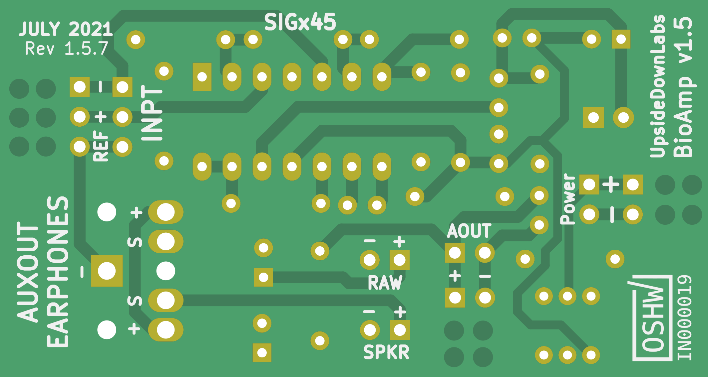
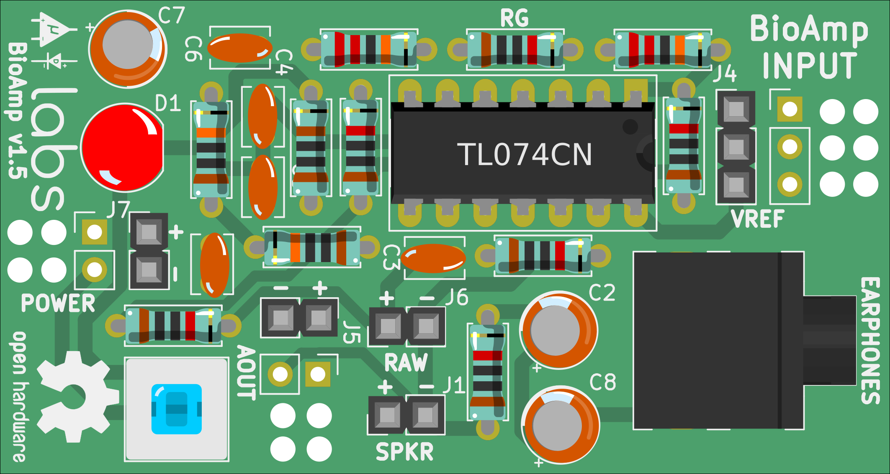
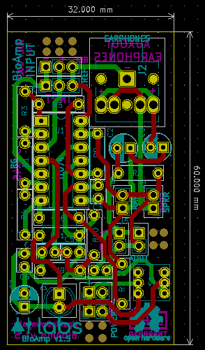
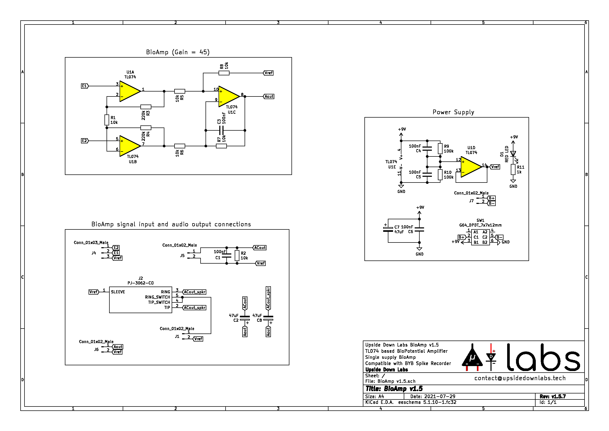
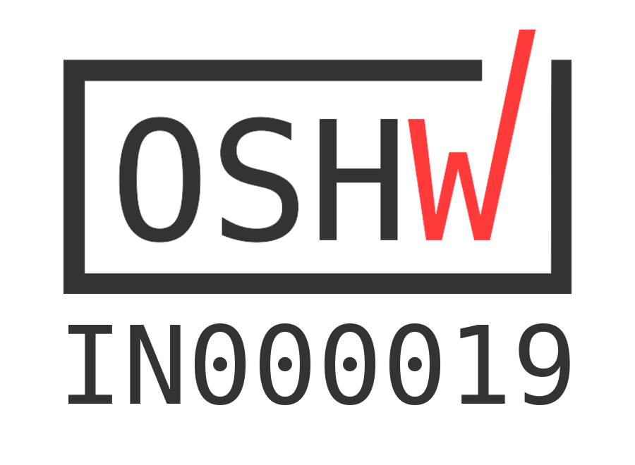

# BioAmp v1.5

                       

BioAmp v1.5 is a single chip Bio-potential amplifier for recording any Bio-potential signal non-invasively. It's compatible with [Backyard Brains Spike Recorder](https://backyardbrains.com/products/spikerecorder), which you can use to record and visualize all the Bio-potential signals. 

## Hardware

BioAmp v1.5 has been created using [KiCad](https://www.kicad.org/) and all the design files can be found under [hardware](hardware/) folder, including production [Gerber](hardware/gerbers) files. Images below shows a quick overview of the hardware design.

| Front             |  Back |
| :-------------------------: | :-------------------------: |
|   |  |

|Assembled PCB|
|:--:|
||

| Dimensions             |  Schematic  |
| :-------------------------: | :-------------------------: |
| 32x60mm  |  |

| Licenses Facts              |  OSHWA Certification |
| :-------------------------: | :-------------------------: |
|   |  |

## License
#### Hardware
CERN Open Hardware License Version 2 - Strongly Reciprocal ([CERN-OHL-S-2.0](https://spdx.org/licenses/CERN-OHL-S-2.0.html)).

#### Software
MIT open source [license](http://opensource.org/licenses/MIT).

#### Documentation:
 This work is licensed under a <a rel="license" href="http://creativecommons.org/licenses/by/4.0/">Creative Commons Attribution 4.0 International License</a>.